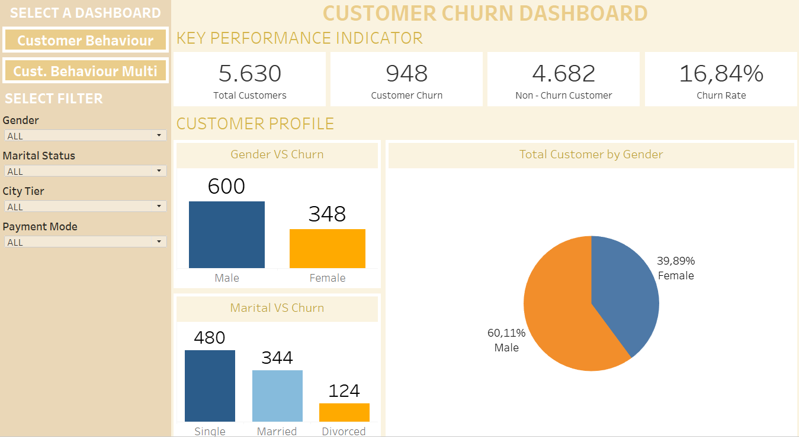
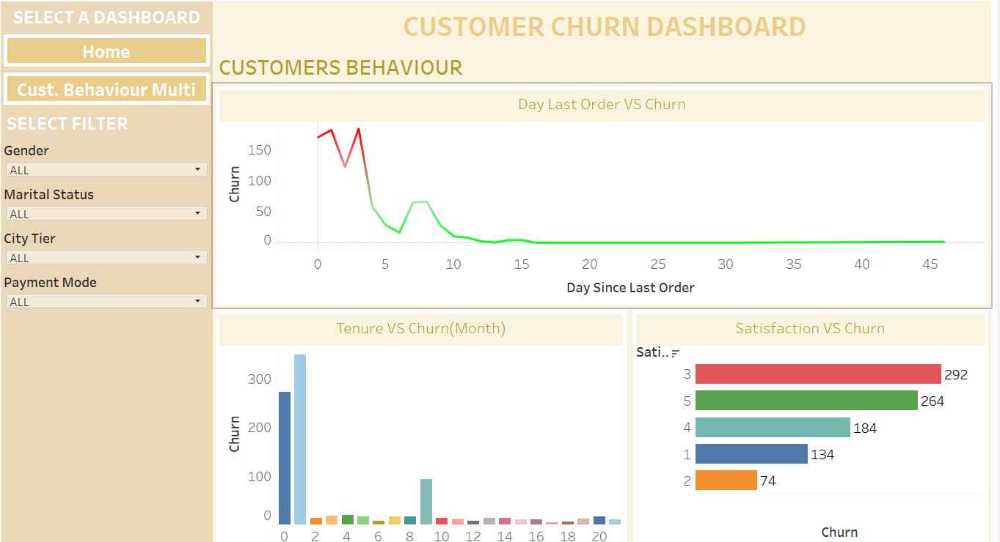
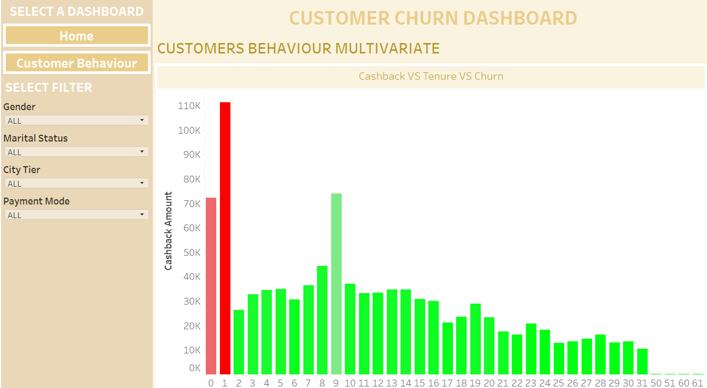

# Customer Churn Analysis
by Rahadian Yaumal Etantyo

Project ini dibuat sebagai Final Project untuk memprediksi kemungkinan pelanggan melakukan churn dengan menggunakan model machine learning. Dataset yang digunakan berisi informasi pelanggan seperti tenure, status complain, jarak pengiriman, dan variabel lainnya.

---

## Deskripsi Project
Tujuan dari project ini adalah:
- Menganalisis dan memprediksi perilaku pelanggan yang berisiko churn berdasarkan data pelanggan.
- Menyajikan hasil analisis dalam bentuk dashboard interaktif (Tableau).
- Mengembangkan model machine learning dan melakukan deployment menggunakan Streamlit.

---

## Tableau Dashboard
Dashboard interaktif dapat diakses melalui link berikut:  
 [Tableau Dashboard](https://public.tableau.com/views/FinproTableu/Home?:language=en-US&:sid=&:redirect=auth&:display_count=n&:origin=viz_share_link)

### Screenshot Dashboard

---

## Streamlit Deployment
Aplikasi model prediksi churn dapat diakses di link berikut:  
[Streamlit App](https://churnpred-pjwtwktpgfbrs3b5unsz9g.streamlit.app/)

---

## Teknologi yang Digunakan
- **Python** 
- **Jupyter Notebook**
- **Tableau Public**
- **Streamlit** (untuk deployment)
- **GitHub** (untuk version control dan repository)

## Insight Utama
- Churn tertinggi terjadi pada pelanggan tenure 0–1 bulan.  
- Banyak churn muncul pada 0–3 hari setelah order pertama.  
- Pelanggan yang komplain memiliki kecenderungan churn lebih tinggi.  
- Jarak pengiriman berkontribusi pada churn.  

## Lisensi
Project ini dibuat untuk keperluan akademik.  
